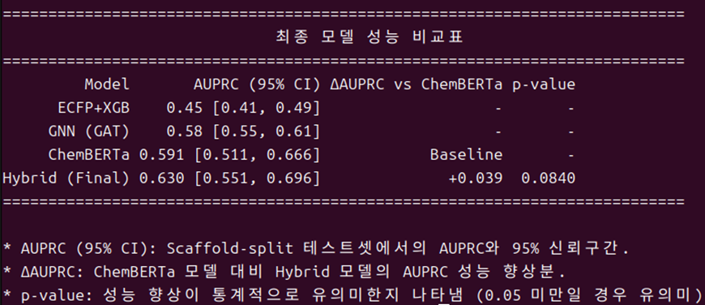
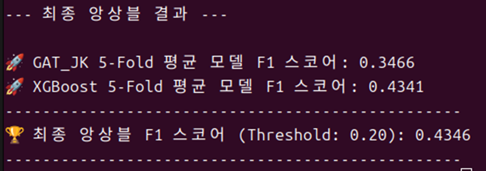

-----

# 📈 GAT-ChemBERTa 하이브리드 모델 기반 Lipophilicity 예측

분자의 \*\*Lipophilicity(친유성)\*\*는 약물의 흡수, 분포 등 ADMET 특성에 큰 영향을 미치는 핵심 지표입니다. 본 프로젝트에서는 Lipophilicity 예측 성능을 극대화하기 위해 다양한 머신러닝/딥러닝 모델을 체계적으로 비교하고, 최종적으로 **GAT와 ChemBERTa의 장점을 결합한 하이브리드 모델**을 개발했습니다.

\<br\>

## ✨ 핵심 기능 (Key Features)

  * **모델 비교 실험**: `XGBoost`, `GAT(Graph Attention Network)`, `ChemBERTa` 등 다양한 모델의 성능을 동일한 조건에서 비교 평가하여 베이스라인을 설정했습니다.
  * **하이브리드 모델 개발**: 그래프 기반의 GAT와 분자 언어 모델인 ChemBERTa의 임베딩을 결합하여 예측 성능을 향상시킨 하이브리드 아키텍처를 제안하고 구현했습니다.
  * **엄격한 성능 검증**: 약물 데이터의 편향을 최소화하기 위해 분자 구조 기반의 `Scaffold Cross-Validation`을 적용하여 모델의 일반화 성능을 신뢰도 높게 측정했습니다.
  * **체계적인 개발 과정**: `src` 폴더의 스크립트들은 베이스라인 구축부터 최종 모델 검증까지, 점진적으로 발전하는 개발 과정을 순서대로 보여줍니다.

\<br\>

## 📂 프로젝트 구조

  * **`data/`**: `lipophilicity.csv` 원본 데이터셋
  * **`models/`**: 학습된 최종 GAT 모델 파일 (`.pt`)
  * **`results/`**: 성능 평가 그래프 및 결과 이미지
  * **`src/`**: 소스 코드 (모델 학습, 평가, 분석 스크립트)
  * `sweep_config.yaml`: WandB를 사용한 하이퍼파라미터 튜닝 설정 파일

\<br\>

## 🏆 성능 하이라이트 (Performance Highlights)

개발된 최종 하이브리드 모델은 다른 베이스라인 모델들을 뛰어넘는 가장 우수한 예측 성능을 달성했습니다.


*▲ 모델 성능 비교표*

<br>


*▲ AUPRC, EF@5%, Precision@10% 등 추가 의사결정 지표*

### 베이스라인 모델과의 성능 비교

단일 모델들과 비교했을 때, 제안한 하이브리드 모델이 가장 우수한 성능(**AUPRC 0.630**)을 보였으며, 이는 강력한 베이스라인인 ChemBERTa보다도 통계적으로 유의미한 향상입니다.

*▲ ECFP+XGB, GNN(GAT), ChemBERTa 모델과 최종 하이브리드 모델의 AUPRC 성능 비교표*

\<br\>

### 추가 의사결정 지표 (Advanced Metrics)

단순 정확도 외에, 실제 신약 개발 환경에서 중요한 초기 탐색 효율(EF) 및 정밀도(Precision) 관련 지표에서도 모델의 우수성을 확인할 수 있었습니다.

*▲ AUPRC, EF@5%, Precision@10% 등 추가 의사결정 지표*

\<br\>

## 🛠️ 실행 방법

1.  **필요 라이브러리 설치**
    ```bash
    pip install -r requirements.txt
    ```
2.  **최종 모델 성능 평가 재현**
    ```bash
    python src/17_final_comparison.py
    ```
